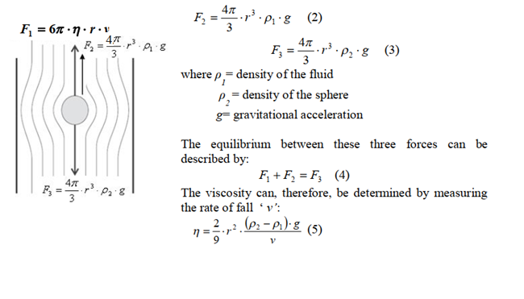
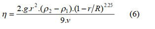

A body moving in a fluid feels a frictional force in a direction opposite to its
direction of motion. The magnitude of this force depends on the geometry of the body, its
velocity, and the internal friction of the fluid. A measure for the internal friction is given
by the dynamic viscosity η. For a sphere of radius r moving at velocity vin an infinitely
extended fluid of dynamic viscosity η, G.G. Stokes derived an expression for the
frictional force:  
 
 If the sphere falls vertically in the fluid, after a time, it will move at a constant
velocity v, and all the forces acting on the sphere will be in equilibrium (Fig. 1): the
frictional force F1 which acts upwards, the buoyancy force F2 which also acts upwards
and the downward acting gravitational force F3. The two forces F2 and F3 are given by: 
 
where 'v' can be determined by measuring the fall time 't' over a given distance 's' 
In practice, equation 5 has to be corrected since the assumption that the fluid extends infinitely in all directions is unrealistic and the velocity distribution of the fluid particles relative to the surface of the sphere is affected by the finite dimensions of the fluid. For more accurate values of viscosity wall effect need to taken into account. The
modified expression for high viscous liquids with the correction is as follows:  
 
While Stokes’ Law is straight forward, it is subject to some limitations.Specifically, this relationship is valid only for ‘laminar’ flow. Laminar flow is defined as a condition where fluid particles move along in smooth paths in lamina (fluid layers gliding over one another). The alternate flow condition is termed ‘turbulent’ flow. This latter condition is characterized by fluid particles that move randomly in irregular paths causing an exchange of momentum between particles.  

Units: The SI physical unit of viscosity is Pascal-second (Pa.s, equivalent to N.s/m2 or kg/ms). The CGS unit is poise (P). Castor oil at room temperature has a viscosity of ~ 650 cP or ~0.65N.s/m2.

