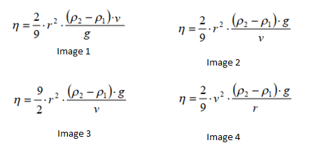
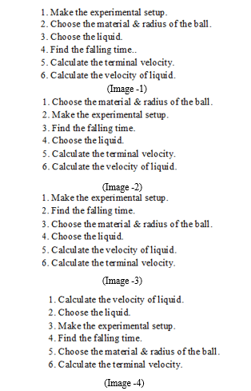

## Pedagogy (Round 1)

 
<b> Experiment Finding Viscosity of Liquid   
  

<b>Discipline | <b>Physical Sciences
:--|:--|
<b> Lab | <b> Basics of Physics
<b> Experiment|     <b> 3. Finding Viscosity of Liquid by Rotating Cylinder
Method

<h4> [1. Focus Area](#LO)
<h4> [2. Learning Objectives ](#LO)
<h4> [3. Instructional Strategy](#IS)
<h4> [4. Task & Assessment Questions](#AQ)
<h4> [5. Simulator Interactions](#SI)

#### 1. Focus Area : Reinforce theoretical concept

#### 2. Learning Objectives and Cognitive Level

Sr. No |	Learning Objective	| Cognitive Level | Action Verb
:--|:--|:--|:-:
1.| Student will be able to identify the principle of viscosity of liquid | Recall | Identify
2.| Student will be able to describe the role of varying radius of steel ball and observe the variation in the falling time | Understand | Describe
3.| Student will be able to predict the average terminal velocity of the falling ball in a given liquid.| Apply | Predict
4.| Student will be able to examine the terminal velocity of the falling ball | Analyse  | Examine
5.| Student will be able to conclude about the viscosity of the liquid. | Evaluate | Conclude

 

    <b><a href="#top">↥ back to top</a></b>

 

#### 3. Instructional Strategy
###### Name of Instructional Strategy  :    Expository
###### Assessment Method: As per handout

<u> <b>Description: </b> of how you are going to implement the above Instructional Strategy in your Simulator: </u>
 
 Brief description as per handout

 

    <b><a href="#top">↥ back to top</a></b>

 

#### 4. Task & Assessment Questions:

Read the theory and comprehend the concepts related to the experiment. [LO1, LO2, LO3]
 

Sr. No |	Learning Objective	| Task to be performed by   the student  in the simulator | Assessment Questions as per LO & Task
:--|:--|:--|:-:
1.| Student will be able to identify the principle of viscosity of liquid | Student will complete introduction.Student will be given 4 images for relation between viscosity and terminal velocity and will choose correct image from them. | The correct image for relation between viscosity and terminal velocity: a) Image 1  b)Image 2 c)Image 3  d)Image4
2.| Student will be able to describe the role of varying radius of steel ball and observe the variation in the falling time. | Student will be given 4 images for the correct procedure to be followed in the experiment. Student will choose correct image from them. | Choose the image which shows the correct order of the procedure to be followed in this experiment: a) Image 1  b)Image 2 c)Image 3  d)Image4
3.| Student will be able to predict the average terminal velocity of the falling ball in a given liquid | Student will make experimental setup followed by taking observations for falling time of the body in liquid | On increasing density of material of the falling ball its terminal velocity:  a) increase  b) decrease c) remains same  d) NOTA
4.| Student will be able to examine the terminal velocity of the falling ball | Student will enter the values of the falling time to calculate the terminal velocity | On increasing the radius of the steel ball to double its value the terminal velocity of the ball become box:  a) double  b) four times  c) eight times  d) sixteen times
5.| Student will be able to conclude about the viscosity of the liquid. | Students will use the calculated value of terminal velocity to calculate viscosity of the liquid and compare with the standard value to calculate the percentage error occurred in the observation. | On increasing density of material of the falling ball its terminal velocity:  a) increase  b) decrease  c) remains same  d) NOTA

 <u> You can add additional TASKS & Assessment Questions <u>
 

    <b><a href="#top">↥ back to top</a></b>

 

#### 4. Simulator Interactions:
 

Sr.No | What Students will do? |	What Simulator will do?	| Purpose of the task
:--|:--|:--|:--:
1.| Simulator will allow student to make experimental setup and will alert him in case of wrong setup made. | Student will slide the power button of the simulator to ON position. | To initiate the simulator 
2.| Simulator will show the green light indicating that the simulator is ready for use.  | Student will choose the desired material and radius of the ball and liquid.  | To set the experimental parameters.
3.| Simulator will show the time of falling ball in the liquid. | Student will mention these values in the table and calculate terminal velocity.  | To calculate terminal velocity.
4.| Simulator will calculate terminal velocity values corresponding to each current value entered in the Table. | Student will press calculate viscosity button.  | To calculate viscosity of liquid.
5.| Simulator will calculate viscosity of the liquid. | Student will click on the calculate percentage error button.  | To note the value of the terminal velocity and calculate the coefficient of viscosity for a given liquid and also to calculate the percentage error with the standard value.
6.| Simulator will calculate the Percentage error in the observation. | Student will change the liquid and will repeat the experiment  | To note the value of the terminal velocity and calculate the coefficient of viscosity for a given liquid and also to calculate the percentage error with the standard value.
